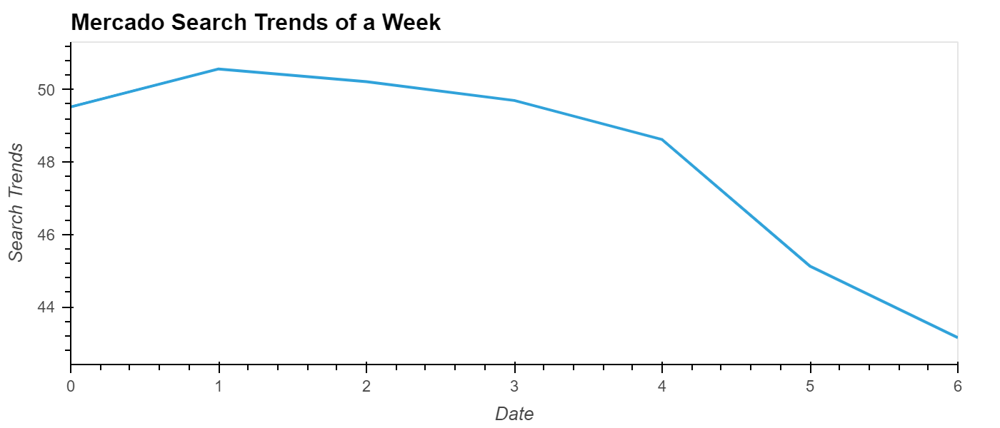
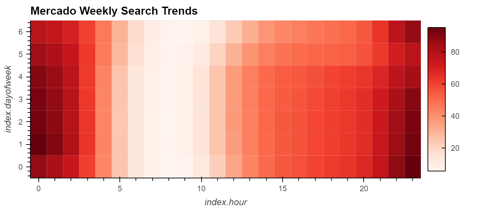
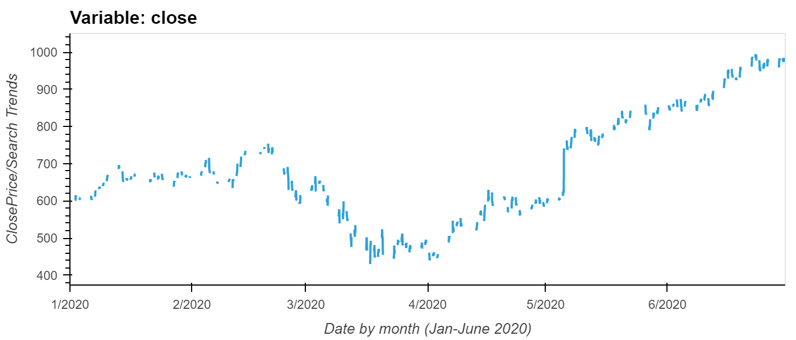
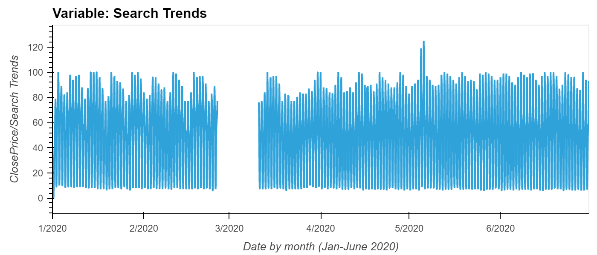
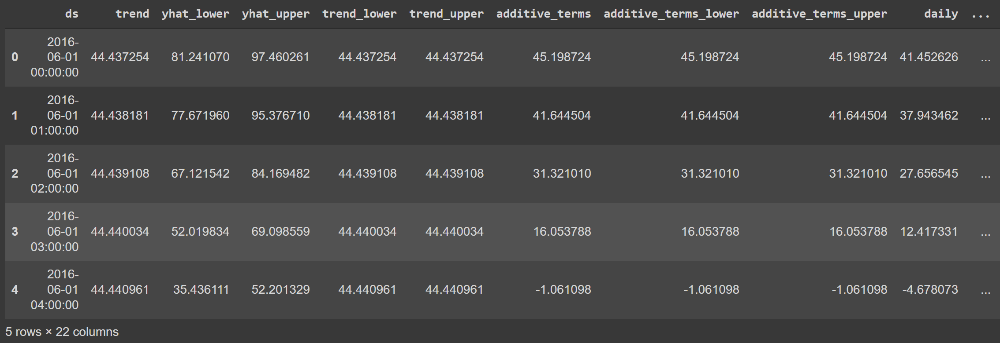

# Forecasting Net Profits
---
## *Necessary Library Installs*

- import pandas as pd
- import holoviews as hv
- from fbprophet import Prophet
- import hvplot.pandas
- import datetime as dt
- import numpy as np
- from pathlib import Path
- %matplotlib inline

***Please Note that this notebook and analysis was done through a Google Colab Notebook.***

## *Analysis*

Because the analysis will be conducted in a Google Colab Notebook, you will need to cofigure the worskspace and connect your data to your Drive. This is done by mounting the Drive into the Notebook:


```
# Upload the "google_hourly_search_trends.csv" file into Colab, 
# then store in a Pandas DataFrame
# Set the "Date" column as the Datetime Index.
from google.colab import drive
drive.mount('/content/drive')
```
Once this is done, you create a ```file_path``` to your file  and read the csv into a Pandas DataFrame.

There are mutliple steps to be done for the analysis of Mercado Libre, and the first one was for locating possible patterns of Google Search trends. 

It was evident that searches of Mercado increased during specific days in a week and even hours. The below graph shows the weekly search trends of Mercado as well as the heatmap to show evident trends in the searches.







Based on the graphs it can be noted that there is an increase in search trends in the beginning of the week during late hours (between 20:00 - 00:00).

After analyzing the search trends, we know need to continue by reviewing the data of the stock price and see if they increase during the times when the search trends are the highest and vice versa (correlation).

To analyze this data, we took the first six months of the year 2020 stock prices and search trends. The data produced the following graphs:






By these graphs it is evident that there is some correlation, but not a whole lot.

Following this analysis, we conducted a forecast for the popularity of Mercado through Facebook Prophet.


To do a prediction through Prophet, we would need to create a Dataframe out of the google search trends and reset the index so that the both the date and google search trends are columns.

```
#Using the df_mercado_trends DataFrame, reset the index so the date information is no longer the index
mercado_prophet_df = df_mercado_trends.reset_index()

#Label the columns ds and y so that the syntax is recognized by Prophet
mercado_prophet_df.columns = ['ds', 'y']

#Drop an NaN values from the prophet_df DataFrame
mercado_prophet_df = mercado_prophet_df.dropna()
```

Afterwards, we create a model, fit it to our data, create a dataframe for future trend predictions and then make the actual predictions.
The resulting dataframe we look like the following snippet with 22 columns predicting:
- trend
- yhat_lower	
- yhat_upper	
- trend_lower	
- weekly	
- weekly_lower	
- weekly_upper	
- yhat
- and more




